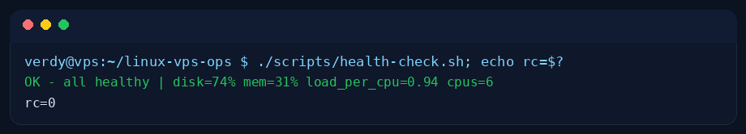
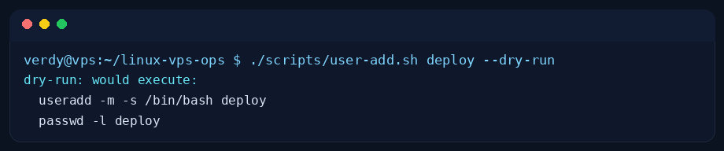
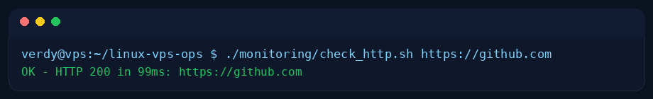
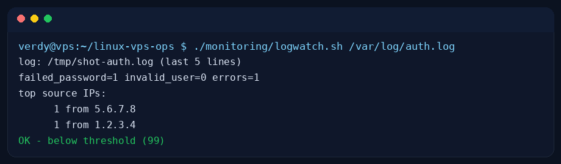

# linux-vps-ops

Daily Linux server operations: health checks, snapshots, directory backups with
rotation, idempotent user provisioning, HTTP monitoring, and log triage —
plus the runbooks and handover template I actually use on shift.

Built from 2+ years running Ubuntu/CentOS VPS fleets for multi-client
operations (ticket-driven, SOP-based, backup/restore discipline).

## Quickstart (fork-friendly, no root required)

```bash
git clone https://github.com/verdynordsten/linux-vps-ops.git
cd linux-vps-ops

./scripts/sysinfo.sh            # one-shot server snapshot
./scripts/health-check.sh       # exit 0 OK / 1 WARN / 2 CRIT
./scripts/backup-dir.sh ./docs ./backups 7
./scripts/user-add.sh deploy --dry-run
./monitoring/check_http.sh https://example.com
./monitoring/logwatch.sh /var/log/auth.log   # or any text log
bash tests/test.sh              # full self-test, zero dependencies
```

Every script has `--help`. Destructive operations default to `--dry-run`
or refuse to run without root — safe to explore on any machine.

## Layout

| Path | What |
|---|---|
| `scripts/sysinfo.sh` | hostname, OS, uptime, disk, memory, load snapshot |
| `scripts/health-check.sh` | threshold-based check, Nagios-style exit codes |
| `scripts/backup-dir.sh` | timestamped `tar.gz` + sha256 + retention rotation |
| `scripts/user-add.sh` | idempotent user provisioning (dry-run by default) |
| `monitoring/check_http.sh` | status-code + latency check with WARN/CRIT |
| `monitoring/logwatch.sh` | failed-login / error triage for auth-style logs |
| `docs/runbook-incident.md` | incident template: what + how + result |
| `docs/shift-handover.md` | handover template |
| `tests/test.sh` | self-test suite (bash + python3 stdlib only) |

## CI

`.github/workflows/ci.yml` runs `bash tests/test.sh` on every push.

## Evidence (real run, Debian 13 server)







